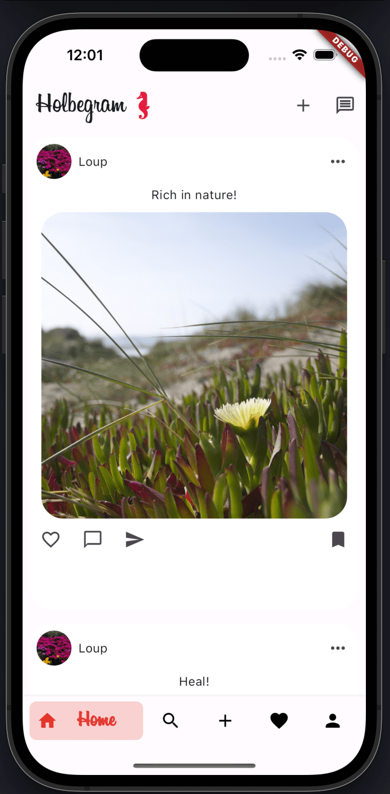

# Holbegram

## Introduction
This project, developed at Holberton School, is a Flutter-based iOS application that mimics Instagram. It allows users to post and share photos, offering a social platform tailored for simplicity and ease of use.

## Technology Stack
- **Flutter**: Used for creating the native iOS app interface and handling user interactions.
- **Firebase**: The project utilizes several Firebase services to enhance functionality:
  - **Firebase Authentication (FireAuth)**: Manages user authentication and security.
  - **Cloud Firestore (FireStore)**: A flexible, scalable database for mobile, web, and server development.
  - **Firebase Storage (FireStorage)**: Provides powerful, simple, and cost-effective object storage.
